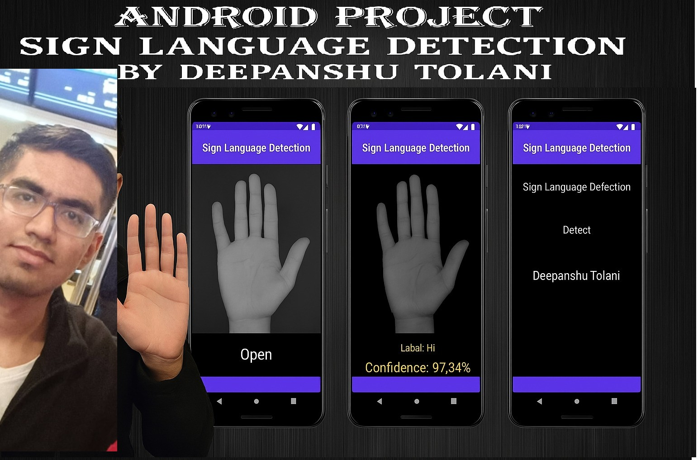

# 🤟 Sign-language Recognition System

This project integrates **sign language recognition** to enhance accessibility for individuals with hearing or speech impairments. By using **hand gesture recognition** and **machine learning models**, the system interprets signs in real time and converts them into **readable or audible outputs**, effectively bridging the communication gap.

## 💡 Features

- Real-time hand gesture recognition  
- Conversion of signs to text and speech  
- User-friendly interface  
- Enhances accessibility and communication for the deaf and mute community  
- Easily extendable with custom gestures and models

## 🛠️ Technologies Used

- Python  
- OpenCV  
- TensorFlow / Keras  
- MediaPipe (for hand tracking)  
- Text-to-Speech (TTS) libraries  
- Streamlit / Tkinter (optional GUI)

## 🚀 How It Works

1. Capture hand gestures via webcam  
2. Process frames using computer vision techniques  
3. Predict sign language using a trained ML model  
4. Display or vocalize the interpreted output

## 📸 Screenshots

## 🤝 Contributing

Contributions are welcome! Feel free to fork the repo and submit a pull request.

📺 Demonstration

Watch the full demonstration on YouTube:
[▶️ Watch Demo on YouTube](https://youtu.be/0RI3yt9EaTk)

## 📬 Contact

If you have any questions or would like to contribute to the project, feel free to reach out:

**Mr. Deepanshu Tolani**  
📧 tolanideepanshu@gmail.com  

---

Made with ❤️ to support accessibility and inclusion.
